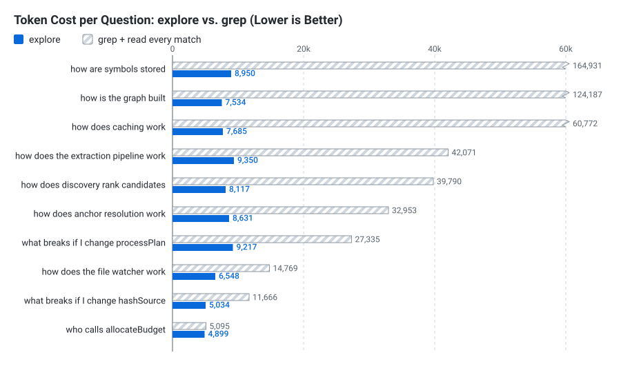

# Creed

**A knowledge graph of your codebase, for AI coding agents.**

[](https://www.npmjs.com/package/creed-kg)
[](LICENSE)
[](https://nodejs.org)

Creed parses your project with Tree-sitter, resolves imports, calls, inheritance and type usage across files, and stores the result as a SQLite index.

Your agent then asks one question in plain English and gets one answer back: the symbols involved, what depends on them, the exact call sites, and the source — already attached. No greps, no follow-up file reads. On this repo that's [2–18× fewer tokens](#performance) than the grep-and-read loop it replaces.

---

## Quick start

Requires **Node 22+**.

```bash
npm install -D creed-kg
npx creed-kg init
```

Restart your editor and your agent has the tool.

`init` indexes the repo, writes MCP config for whichever editors it finds, and adds `.creed/` to your `.gitignore`. It merges rather than overwrites, and re-running it is a no-op. Use `--all` for every supported editor, or `--editor cursor` for one.

After that a file watcher keeps the index current, re-parsing only what changed. There is no re-index command.

<details>
<summary><b>Configuring an editor by hand</b></summary>

Same block everywhere, with no project path to fill in — Creed walks up from wherever it's launched to find the root:

```json
{
  "mcpServers": {
    "creed": {
      "command": "npx",
      "args": ["-y", "creed-kg", "mcp"]
    }
  }
}
```

| Editor | Where it goes |
| :--- | :--- |
| **Claude Code** | `.mcp.json` — or `claude mcp add creed -- npx creed-kg mcp` |
| **Cursor** | `.cursor/mcp.json` or `~/.cursor/mcp.json` |
| **Kiro** | `.kiro/settings/mcp.json` |
| **Gemini CLI** | `.gemini/settings.json` |
| **VS Code / Copilot** | `.vscode/mcp.json` — key is `servers`, not `mcpServers` |
| **Claude Desktop** | `npx creed-kg setup` |
| **Windsurf** | `~/.codeium/windsurf/mcp_config.json` |
| **Codex CLI** | `~/.codex/config.toml` — `[mcp_servers.creed]` |
| **Antigravity** | the editor's MCP settings panel |

Since the block carries no path, a global config works in every project you open.

If you skip `init`, add `.creed/` to `.gitignore` yourself — it's a derived cache and doesn't belong in version control.
</details>

---

## Using it

**Through your agent.** One MCP tool, `explore`. Your agent reaches for it on its own.

**From your terminal.** Same engine, same index:

```bash
npx creed-kg query "how does authentication work"
npx creed-kg query "UserService save"
npx creed-kg query "src/auth login token refresh"
```

`query` builds an index first if there isn't one, so it works with or without `init`.

**In a browser.** `npx creed-kg serve .` opens an interactive graph explorer — flat, module, service, API and data views, a details inspector, and execution-flow tracing. Ships prebuilt.

https://github.com/user-attachments/assets/27c56b1f-8baa-4267-80ed-986f58063ebc

---

## What comes back

Formatted markdown with the code already in it, not a JSON blob:

````
**Exploration: what breaks if I change hashSource**

Anchored on: `hashSource` (function — src/storage/sqlite/partial-cache.ts:24)

Found 9 symbol(s) across 5 file(s).

**Blast radius — what depends on these (update/verify before editing)**

- `hashSource` (function — src/storage/sqlite/partial-cache.ts:24) — 4 caller(s) across src/pipeline.ts, tests/partial-cache.test.ts

**Relationships**

- `Pipeline.build` --[call]--> `hashSource` [resolved-via: import]
  src/pipeline.ts:60 → `const contentHash = hashSource(file.sourceCode);`
- `watchAndRebuild` --[call]--> `Pipeline.build` [resolved-via: scope]
  src/watcher.ts:56 → `result = await pipeline.build(targetDir, { cache });`

**Source Code**

**`src/storage/sqlite/partial-cache.ts`** — hashSource(function)

```typescript
24	export function hashSource(sourceCode: string): string {
25	  return crypto.createHash('sha1').update(sourceCode, 'utf8').digest('hex');
26	}
```
````

- **The anchor is stated.** You asked in English; the header names the symbol it resolved to, so a wrong anchor is visible instead of buried under a confident answer.
- **Blast radius comes first** — what depends on it, and where those callers live.
- **Every edge carries its call site** — file, line, and the line of code.
- **Source is line-numbered**, so the agent can cite `partial-cache.ts:24` without reopening the file.

---

## One tool

`explore` takes symbol names, file names, plain English, or all three mixed together.

| Ask it | And it |
| :--- | :--- |
| "how does crawling work" | anchors on every symbol the concept spans |
| "where is `X` defined" | anchors on the definition and its neighbourhood |
| "what does `X` connect to" | traverses outward from `X` |
| "how does A reach B" | synthesizes the call path between them |
| "what breaks if I change `X`" | flips to incoming edges, traces the dependency cone |

Nothing to choose between, and no anchor to look up first — the whole question resolves at once. That matters most when the word you used isn't the word in the code:

- **Concepts spanning several symbols anchor on all of them.** "crawling" returns `crawl_site`, `crawl_competitors` and `get_crawled_pages`, rather than picking one.
- **Word endings reach the code's spelling** — "resolution" finds `AnchorResolver`, "traversal" finds `traverse`.
- **Typos resolve** — "anchor resolvr" lands on `AnchorResolver`.
- **Generic words are searched, not discarded** — a project built around `Config` is findable by asking for "config".
- **Co-occurring words reinforce each other** — "voice agent context" ranks the file where all three land above one that matches only one.

Terms matching nothing are ignored, and the answer says so when they add up to a real share of the question.

`depth`, `direction`, `edgeKinds` and `maxAnchors` are inferred from the question, and available when you want to steer it.

---

## It tells you when it isn't sure

Every edge is labelled with **how** it was resolved:

```
- Pipeline.build --[call]--> hashSource        [resolved-via: import]
- ParserRegistry.getParser                     [⚠ low-confidence: name-only match]
  ⚠ 3 unresolved reference(s) from here: this.parsers.get, this.getLanguageObject
```

`resolved-via: import/scope` means the resolver followed a real link. `⚠ low-confidence` means it fell back to a name match and you should treat it with suspicion.

That's the difference between "nothing depends on this" and "I couldn't tell" — indistinguishable in a grep workflow, and very different to act on. It caught two real resolver bugs during Creed's own development.

Questions get the same treatment: if most of what you asked matched nothing, or you named two symbols with no path between them, a footer says so — below the content, so warnings on good results never train you to skip them.

---

## Performance

### Tokens

<picture>
  <source media="(prefers-color-scheme: dark)" srcset="assets/chart-light.svg">
  
</picture>

Across ten questions on this repo:

| | Total tokens | vs `explore` |
| :--- | ---: | ---: |
| `explore` | **75,965** | — |
| grep + read every match | 523,569 | 6.9× |
| grep + read top 5 files | 211,716 | 2.8× |

The multiplier isn't the interesting part. The spread is:

| | cheapest | dearest | spread |
| :--- | ---: | ---: | ---: |
| `explore` | 4,899 | 9,350 | **1.9×** |
| grep + read | 5,095 | 164,931 | **32.4×** |

Creed ranks results down to a token budget, so cost barely moves with how broad your question is. grep's cost tracks how common your word happens to be: `symbol` matches 1,259 lines across 63 files here, and reading them is 164,931 tokens — more than most context windows hold, for one question.

**Where it doesn't help.** `who calls allocateBudget` came out at 4,899 vs 5,095 — noise. When a symbol is rare and lives in small files, grep was already cheap. The savings come from breadth.

<details>
<summary><b>Per-question numbers and methodology</b></summary>

| Question | `explore` | grep + read every match | grep + read top 5 |
| :--- | ---: | ---: | ---: |
| what breaks if I change `hashSource` | 5,034 | 11,666 | 11,666 |
| what breaks if I change `processPlan` | 9,217 | 27,335 | 19,134 |
| who calls `allocateBudget` | 4,899 | 5,095 | 5,095 |
| how does anchor resolution work | 8,631 | 32,953 | 24,409 |
| how does the file watcher work | 6,548 | 14,769 | 12,409 |
| how does caching work | 7,685 | 60,772 | 17,050 |
| how does discovery rank candidates | 8,117 | 39,790 | 19,862 |
| how does the extraction pipeline work | 9,350 | 42,071 | 10,729 |
| how is the graph built | 7,534 | 124,187 | 40,057 |
| how are symbols stored | 8,950 | 164,931 | 51,305 |
| **Total** | **75,965** | **523,569** | **211,716** |

The baseline is deliberately generous: **one** grep, with a pattern that already contains the right symbol name — as if the agent guessed perfectly — then reads what it matched. Real agents grep two or three times with imperfect patterns, read irrelevant files, and re-grep for callers. None of that is counted.

Two columns because agents differ. Reading every match is the only one that actually covers what Creed's answer covers; reading the top five accepts that it might miss the caller that mattered.

Reproduce it:

```bash
npx tsx scratch/bench-tokens.ts
```
</details>

### Scale

The index lives in SQLite, not in memory, and lookups go through real indexes — including an FTS5 trigram index for substring search:

| Codebase | Symbol lookup | Memory |
| :--- | ---: | ---: |
| 10k symbols | 0.7 ms | ~0 |
| 50k symbols | 1.8 ms | ~0 |
| 200k symbols | **1.7 ms** | **~0** |

An in-memory graph answers that 200k-symbol lookup in 94.6 ms and holds 75.6 MB of heap to do it.

### Rebuilds

Parse output is cached and keyed by content hash, so a rebuild only touches what changed:

| | Time |
| :--- | ---: |
| First index (110 files) | 3.97s |
| Rebuild, nothing changed | **0.15s** |
| Rebuild, one file edited | **0.16s** |

Cheap enough to just always be current, which is why staleness never becomes your problem.

---

## Languages and frameworks

**TypeScript · TSX · JavaScript · JSX · Python · Java · HTML**, via native Tree-sitter grammars.

Creed also recognises what your code means, not just its shape. Adapters detect **FastAPI, Flask, NestJS and Express** routes, ORM data models and service classes, and attach them to the graph — so `explore "POST /login"` resolves to the handler.

Cross-file resolution follows imports, class inheritance, instance-method calls through local variables, and `this.field.method()` chains — through the field's declared type, interface members, imported types, and standard-library and dependency types, which become explicit nodes marking where your code meets its dependencies.

---

## Commands

| Command | What it does |
| :--- | :--- |
| `npx creed-kg init` | Index the repo and connect it to your editors |
| `npx creed-kg query "<question>"` | Ask about your codebase and print the answer |
| `npx creed-kg mcp` | Run as an MCP server |
| `npx creed-kg serve` | Open the visual explorer |
| `npx creed-kg setup` | Write the Claude Desktop config |
| `npx creed-kg` | Index and print a report |

Every command finds the project root on its own; `--path <dir>` overrides it. `CREED_NO_CACHE=1` forces a full re-parse. Deleting `.creed/` is always safe — the next command rebuilds it.

<details>
<summary><b>Reading the index directly</b></summary>

It's a normal SQLite database at `.creed/graph.db`:

```bash
sqlite3 .creed/graph.db "SELECT name, kind, file_path FROM symbols WHERE name_lower = 'userservice';"
```

Or drive the pipeline from code:

```typescript
import { Pipeline, SqliteSemanticModelStorage, SqliteKnowledgeGraph } from 'creed-kg';

const project = './my-project';

// Index it (fileRecords carry the parse cache, so the next build starts warm)
const { model, fileRecords } = await new Pipeline().build(project);
await new SqliteSemanticModelStorage().save(model, project, fileRecords);

// Query it — indexed lookups, bounded memory
const graph = new SqliteKnowledgeGraph(project);
console.log(graph.getCallersOf('src/auth.ts::login').map(n => n.id));
graph.close();
```
</details>

---

## Contributing

```bash
git clone https://github.com/jaarso0/CREED.git
npm install
npm test
```

[**Architecture**](architecture.md) · [**Deep dive**](deep_dive_architecture.md) · [**Coverage notes**](limitations.md)

MIT licensed.